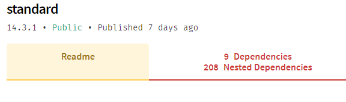

# NPM nested dependencies count
  
A simple browser extension that shows you the total count of nested dependencies for an npm package.

### Why?
Most people will agree that the JS ecosystem is bloated, packages that depend on packages that depend on packages that depend on packages that...  
It's a never ending list of folder and files.  

NPM's current layout only displays the direct dependencies, it can create "tip of the iceberg" scenenarios where a package that has only 2 direct dependencies can have hundred nested ones.

Before installing a package consider this : is it worth it? Are you willing to pay for the overhead?
Hopefully this extension will make developers more cautious of packages and consider not using them in some situations

### Manual Chrome Installation
This extension is not yet available in the chrome web store.  
In the meantime you can still manually install it.

* Download a [release](https://github.com/bibo5088/npm-nested-dep/releases) and extract it somewhere
* Go to `chrome://extensions/`
* Enable developer mode
* Click on "Load unpacked extension" and select the previously extracted folder
